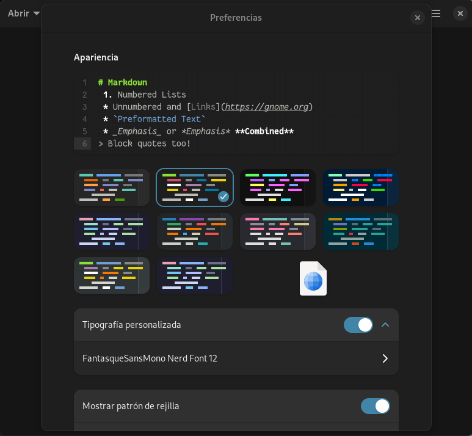

# Catpuccin GtkSourceView5

This is an unofficial port of the Catpuccin themes for GtkSourceView5, so it
works with GNOME Builder and GNOME Text Editor

## How to install (GUI) (GNOME Builder & GNOME Text Editor)

1. Clone this repository:

```sh
git clone https://github.com/Diego-Ivan/catpuccin-gtksourceview5
```

2. Open the folder with a File Manager
3. Open GNOME Builder/GNOME Text Editor
4. Open preferences
5. Drag and drop the `.xml` file(s) in the theme chooser. This will install the themes for any app that uses GtkSourceView5



## How to install (Command Line)

1. Clone this repository:

```sh
git clone https://github.com/Diego-Ivan/catpuccin-gtksourceview5
cd catpuccin-gtksourceview5/themes
```

2. Copy the files to `/usr/share/gtksourceview5`

```sh
cp *.xml /usr/share/gtksourceview5
```
